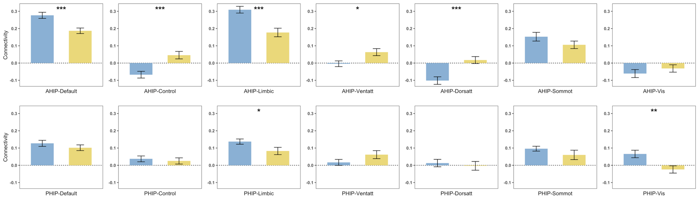
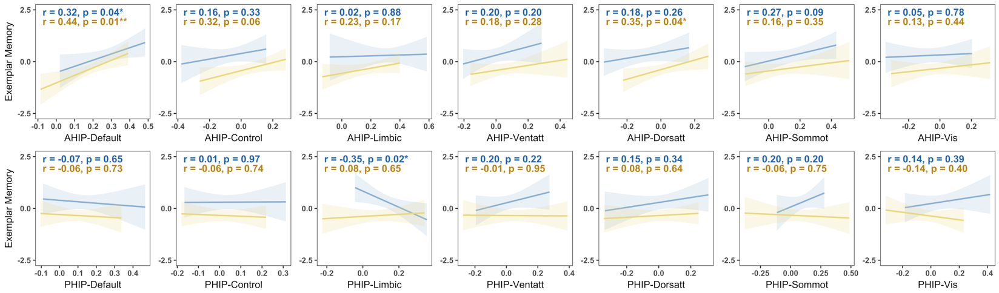

# fcnet

Tools for analyzing network-level functional connectivity from fMRI data
using parcellated brain atlases. Designed for the Schaefer atlas but
adaptable to other parcellation schemes.




## Installation

Install from GitHub with `devtools`:

```r
# install.packages("devtools")
devtools::install_github("shijing-z/fcnet")
```

To load connectivity matrices from CONN toolbox `.mat` files, you also
need `NetworkToolbox`:

```r
install.packages("NetworkToolbox")
```

## Quick Start

```r
library(fcnet)

# Package includes example data: 30 ROIs x 10 subjects
dim(ex_conn_array)
#> [1] 30 30 10

# Organize ROIs by network
indices <- get_indices(ex_conn_array)

# Network-level connectivity (Schaefer networks only)
indices_sch <- get_indices(ex_conn_array, roi_include = "schaefer")
# Results are data frames — one row per subject, one column per network
within  <- calc_within(ex_conn_array, indices_sch)
between <- calc_between(ex_conn_array, indices_sch)

# ROI-to-network connectivity
ahip_df <- calc_conn(ex_conn_array, indices,
                     from = "ahip", to = c("default", "cont", "vis"))

# Visualize
plot_heatmap(ex_conn_array, indices)
```

## Core Workflow (with your own data)

The examples below show a typical analysis pipeline. Replace file paths,
subject indices, and variable names with your own.

### 1. Load Data

Load connectivity matrices from CONN toolbox output (requires
`NetworkToolbox`):

```r
# rmat has ROI names in CONN toolbox .mat files — use it for organizing ROIs
r_mat <- load_matrices("data/conn.mat", type = "rmat", exclude = c(46, 57))

# zmat (Fisher z-transformed)
z_mat <- load_matrices("data/conn.mat", type = "zmat", exclude = c(46, 57))
```

Or bring your own 3D array (ROI x ROI x subjects) with ROI names in
`dimnames`.

### 2. Organize ROIs

```r
# Extract ROI positions grouped by network
indices <- get_indices(r_mat)

# Schaefer networks only (exclude custom ROIs)
indices_sch <- get_indices(r_mat, roi_include = "schaefer")

# Group custom ROIs manually
indices_hip <- get_indices(r_mat,
  manual_assignments = list(ahip = "hippocampus", phip = "hippocampus"))
```

### 3. Calculate Connectivity

```r
# Within-network: mean connectivity inside each network
within_df <- calc_within(z_mat, indices_sch)

# Between-network: each network averaged across all other networks
between_df <- calc_between(z_mat, indices_sch)

# Between-network: each unique network pair separately
pairwise_df <- calc_between(z_mat, indices_sch, pairwise = TRUE)

# User-defined: any ROI/network to any target(s)
ahip_df <- calc_conn(z_mat, indices,
  from = "ahip", to = c("default", "cont", "limbic"))
```

### 4. Visualize

All plot functions return `ggplot` objects for further customization.

```r
# Connectivity matrix heatmap
plot_heatmap(z_mat, indices, subjects = demo$group == "YA", title = "Young Adults")

# Group comparison bar chart
within_df <- cbind(within_df, group = demo$group)
plot_compare(within_df,
  conn_vars = c("within_default", "within_vis"),
  group = "group")

# Connectivity-behavior scatter
ahip_df <- cbind(ahip_df, demo[c("group", "memory")])
plot_scatter(ahip_df, x = "ahip_default", y = "memory", group = "group")
```

## Atlas Compatibility

`get_indices` works with any Schaefer atlas version and supports
non-Schaefer ROIs. Attention network naming variations across atlas
versions are automatically normalized.

## License

MIT